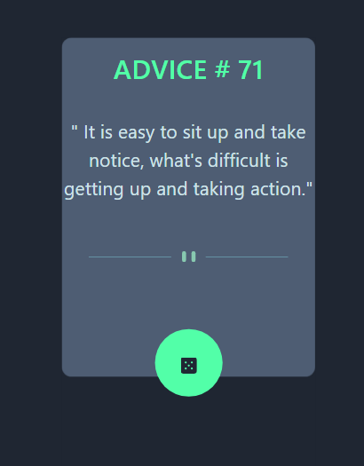

# Frontend Mentor - Advice generator app solution

This is a solution to the [Advice generator app challenge on Frontend Mentor](https://www.frontendmentor.io/challenges/advice-generator-app-QdUG-13db). Frontend Mentor challenges help you improve your coding skills by building realistic projects.

## Table of contents

- [Overview](#overview)
  - [The challenge](#the-challenge)
  - [Screenshot](#screenshot)
  - [Links](#links)
- [My process](#my-process)
  - [Built with](#built-with)
  - [What I learned](#what-i-learned)
  - [Continued development](#continued-development)
  - [Useful resources](#useful-resources)
- [Author](#author)

## Overview

### The challenge

Users should be able to:

- View the optimal layout for the app depending on their device's screen size
- See hover states for all interactive elements on the page
- Generate a new piece of advice by clicking the dice icon

### Screenshot



### Links

- Solution URL: [Github]()
- Live Site URL: [Live Github]()

## My process

### Built with

- Semantic HTML5 markup
- Sass/SCSS
- Bootstrap
- jQuery/Javascript
- Mobile-first workflow


### What I learned

- I wasn't sure at first if the url needed to be re-fetched again and again or just once.
  I had it working with code that re-fetched the url again on every button click, but I noticed a 
  lag that meant I had to click twice to re-fetch a new advice.
  So I changed my code to just fetch the url once (thinking the lag was because of re-fetching the url on each button click) :
  
  ```
    //partial code from $(window)onload function from advice-generator-app-main.js 
    let again=true;
	displayAdvice(urlStart,ids,again);
	onClick('#dice',function(){
	    displayAdvice(url, ids,again);
		again=false;
    });
	//displayAdvice function from json-functions.js 
	async function displayAdvice(url,displayWhere,again){
	   let data='';
	   if(again===true){
	     data= await(getJson(url)); 
       }
	   for (key in data) {
         displayWhere[0].textContent=`${data[key]['id']}`;
		 displayWhere[1].textContent=` ${data[key]['advice']}`;
       }
    }
	```
	That did not re-fectch new advice on subsequent button clicks.
	Then I read this on the adviceslip.com site:
	> Advice is cached for 2 seconds. Any repeat-request within 2 seconds will return the same piece of advice.
  
    So the lag is normal and re-fetching is required.
-   Had the code working with a fetch version:
    ```
	  //json-functions.js
	  function getJson(url) {
        return fetch(url)
        .then(response => response.json())
        .then(response => response)
        .catch(err => {
           console.error(err);
        });  
      }

      async function displayAdvice(url,displayWhere){
	    let data= await(getJson(url)); 
	    for (key in data) {
           displayWhere[0].textContent=`${data[key]['id']}`;
		   displayWhere[1].textContent=` ${data[key]['advice']}`;
        }
      }
	  //advice-generator-app-main.js relevant code
	  const urlStart='https://api.adviceslip.com/advice/117';
      const url= 'https://api.adviceslip.com/advice';

      $(window).on('load',function(){
	     let ids = displayWhere.map(function(element){
		    let id = document.querySelector(element);
		    return id;
	     });
	     //display some random advice on first load
	     displayAdvice(urlStart,ids);
 
	     //display randome advice on the user clicking the dice button
	     onClick('#dice',function(){
	       displayAdvice(url, ids);
         });
      });
	```
	But decided to try to use the XMLHttpRequest (XHR) method this time, even though from what I read it's not as 
	powerful and flexible, I think it's good to know how to use both ways.
-   I had some trouble also filling the color for the two rectangles in the pattern svg.
    Till I found a stackoverflow post that explained how.
-   I then noticed that it was possible to retrieve a new advice either by search or by ID at least.
    
	I first tried loading the page by getting an advice by ID, id # 117, so used the url for that.
	```
	  //json-functions.js relevant code
	  function displayAdvice(data,displayWhere){
	
	     for(const key in data) {
            if(data.hasOwnProperty(key) ) {
		      const value = data[key];
              document.querySelector(displayWhere[0]).textContent=`${value.id}`;
		      document.querySelector(displayWhere[1]).textContent=`" ${value.advice}"`;
            }
         }
      }
      //advice-generator-app-main.js relevant code
      const urlStart='https://api.adviceslip.com/advice/117';
      const url= 'https://api.adviceslip.com/advice';

      $(window).on('load',function(){
	     let ids = displayWhere.map(function(element){
		   let id = document.querySelector(element);
		   return id;
	     });
	     //display some random advice on first load
	     getJson(urlStart,ids,displayAdvice);

	     //display randome advice on the user clicking the dice button
	     onClick('#dice',function(){
	      getJson(url, ids,displayAdvice);
         });
      });	  
	```
	I decided to go with the idea to load the design advice on page load instead.
	I copied the advice text from the design example and used that in the search url.
	It was then able to retrieve the advice by text as seen in the design. 

### Continued development

- Daily tutorials and projects in HTML5, CSS3, Javascript, Bootstrap, Sass/SCSS. For now, in time I will go re-learn React ect.

### Useful resources

[How to set fill color for svg rect](https://stackoverflow.com/questions/48023788/how-to-set-fill-color-for-svg-rect)

## Author

- Website - [One of my latest codepens](https://codepen.io/cynthiab72/pen/oNybYON)
- Frontend Mentor - [@cmb347827](https://www.frontendmentor.io/profile/cmb347827)

